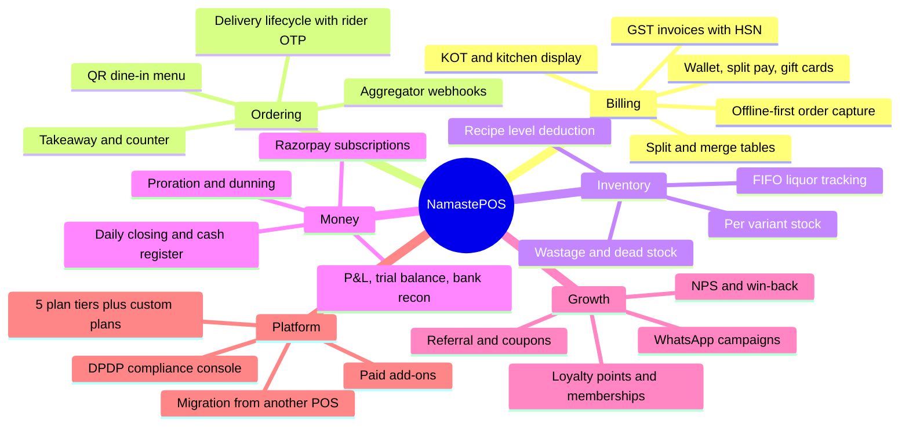
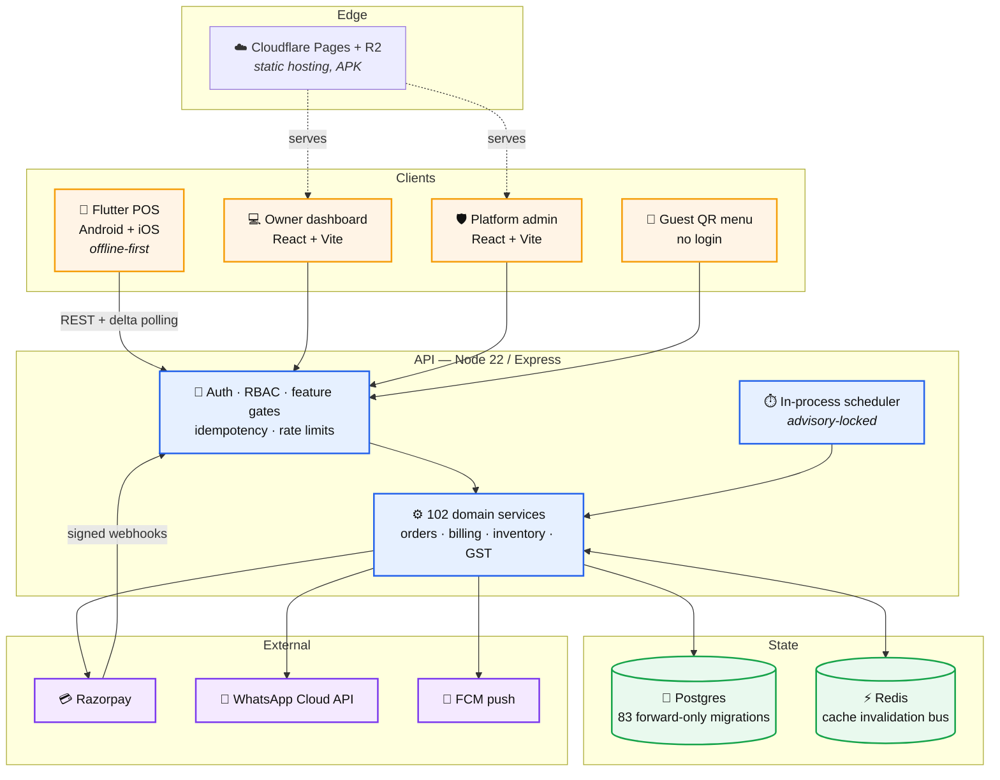
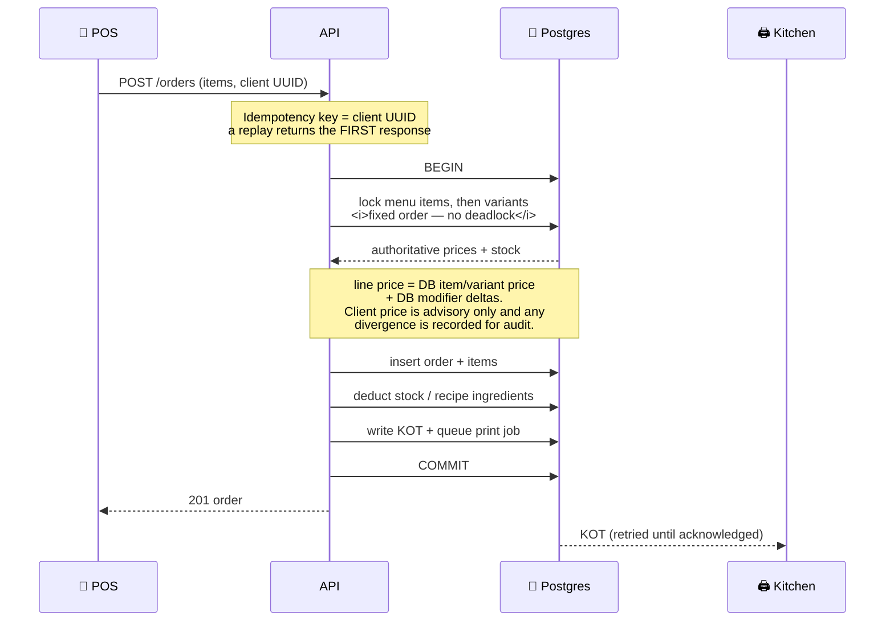

<div align="center">

<h1>🍛 NamastePOS</h1>

**Restaurant billing that just works — mobile-first, offline-ready, built for India.**

A production multi-tenant SaaS: Android/iOS POS, web dashboard, platform admin console,
GST-compliant invoicing, UPI & Razorpay payments, QR dine-in ordering, WhatsApp receipts —
running live for real restaurants.

[](https://api.namastepos.in/v1/health)
[](#-quality-gates)
[](#-tech-stack)
[](#-tech-stack)
[](#-tech-stack)

[**Website**](https://namastepos.in) · [**Web app**](https://app.namastepos.in) · [**Download APK**](https://pub-b587dcaedebf4ce59386af9fa20fac8c.r2.dev/NamastePOS.apk)

</div>

---

## 📖 What this is

Most Indian restaurants run on a POS that assumes a desk, a Windows PC and a live internet
connection. NamastePOS assumes none of those: the till is the phone in the owner's pocket, the
network drops mid-service, and the bill has to be GST-correct anyway.

Every design decision in here follows from that:

| The reality | What the system does about it |
|---|---|
| The internet drops mid-order | Orders are written locally and replayed on reconnect, keyed so a replay can never double-charge |
| The phone is the till | Flutter app first; the web dashboard is the back-office, not the counter |
| A bill is a legal document | Server-authoritative pricing, GST/HSN per item, tax-sequence integrity, e-invoice ready |
| Staff share one device | Phone + PIN login, live permission checks on every request, fail-closed roles |
| Owners run 2–5 outlets | Each outlet is a fully isolated tenant under one group, with plans and staff synced from HQ |

---

## ✨ Feature map



---

## 🏗️ Architecture



<details>
<summary><b>Repository layout</b></summary>

```
namastepos_backend/     Node 22 · Express · raw SQL · 102 services · 34 route modules
namastepos_flutter/     Flutter POS — 115 Dart files, sqflite offline cache
namastepos_dashboard/   Owner web app — React 18 · Vite 7 · TS (59 pages)
namastepos_admin/       Platform console — plans, billing ops, compliance (27 pages)
namastepos_landing/     Marketing site — hand-built, live plan feed from the API
namastepos_print_agent/ Local bridge for USB/LAN thermal printers
ops/keepalive-worker/   Cloudflare Worker keeping the free-tier API warm
docs/                   DR drill, integration setup, reviews
tests/e2e/              Playwright · load/ k6 scripts
```
</details>

---

## 🧾 The order path

The money path is the part worth reading. It is one database transaction, and the client is
never trusted with a price.



**Why it is built this way**

- **Server-authoritative pricing** — a tampered client cannot bill ₹1 for a ₹300 pizza; variants must belong to the item, modifiers to an attached group, and discounts cannot exceed the bill.
- **Idempotent writes** — every offline-replayed mutation carries a stable key, so a lost response can't double-charge a refund or double-deduct stock.
- **Nothing best-effort inside a bill** — the kitchen ticket and the stock movement are in the order's own transaction; a print failure retries instead of silently losing the ticket.
- **Multi-tenant by construction** — every lookup is scoped to the business, and platform staff are denied the tenant API by default.

---

## 🔐 Security & compliance

| Area | Approach |
|---|---|
| Auth | JWT access + rotating refresh bound to the user; owner MPIN; staff phone + PIN with persistent lockout |
| Authorisation | Live DB permission check per request — never trusted from the token; roles fail **closed** |
| Tenant isolation | Business-scoped queries throughout; platform staff denied tenant data by default, impersonation is read-only and audited |
| Financial privacy | The platform console sees aggregates, not a tenant's order ledger or diner PII |
| Secrets | Env-only, fail-loudly; no fallbacks for secrets; signing keys never in the repo or CI |
| Admin access | Mandatory 2FA, httpOnly cookie auth, CSRF protection, full audit log |
| Data protection | DPDP console — data-subject requests, grievance officer, breach register, retention cron |
| Payments | Razorpay signed webhooks with replay-safe dedupe; money handled in paise |

---

## ✅ Quality gates

Every push to `main` runs:

| Gate | What it proves |
|---|---|
| **592 Jest tests** (65 suites) | Integration-level, against a real Postgres |
| **Migration double-run** | All 83 migrations apply forward *and* survive a re-run |
| **ESLint — 0 errors** | Blocking, down from 6,431 |
| **`tsc` + build ×2** | Dashboard and admin type-check and build |
| **`flutter analyze`** | Blocking, on a pinned Flutter so local and CI agree |
| **Playwright + k6** | End-to-end money flows and an order-race load script |

Migrations are **forward-only and additive** — no destructive DDL, ever — and are applied by the
deploy before the new code serves a request.

---

## 🛠️ Tech stack

<div align="center">

| Layer | Choice | Why |
|:--|:--|:--|
| **Mobile** | Flutter 3.44 · provider · sqflite · dio | One codebase, real offline storage, runs on the ₹8,000 Android phones restaurants actually own |
| **API** | Node 22 · Express 4 · **raw SQL** · Joi | No ORM: the money path is explicit locks and transactions you can read |
| **Database** | Postgres 14 · Neon in production | Advisory locks, `FOR UPDATE`, JSONB where it earns it |
| **Cache** | Redis (Upstash) | Pub/sub invalidation so a revoked permission dies on every instance |
| **Web** | React 18 · Vite 7 · TypeScript · Tailwind · react-query | |
| **Infra** | Render · Cloudflare Pages + R2 · GitHub Actions | Push to `main` deploys API, dashboard, admin and site |
| **Observability** | Sentry · Winston · nightly revenue-integrity mail | Nine automated checks for money that stopped reconciling |

</div>

---

## 🚀 Local development

```bash
# 1 — Postgres
createdb namastepos

# 2 — API
cd namastepos_backend
cp .env.example .env          # fill DATABASE_URL and JWT_SECRET (no defaults, it fails loudly)
npm ci && npm run migrate && npm run dev

# 3 — Owner dashboard
cd ../namastepos_dashboard && npm ci && npm run dev

# 4 — Mobile app
cd ../namastepos_flutter && flutter pub get && flutter run
```

```bash
npm test                      # 592 integration tests (needs a Postgres)
npm run lint                  # blocking, 0 errors
```

---

## 📐 Engineering principles

> These are enforced, not aspirational.

1. **Never trust the client with money.** Prices, discounts and taxes are computed server-side from the database.
2. **Migrations are additive.** No dropped columns, no destroyed data — a rollback must never cost a restaurant its history.
3. **No hardcoded secrets, and no fallbacks for them.** Missing config fails loudly at boot.
4. **Tenant-scope every lookup.** An id from a request is meaningless without the business it belongs to.
5. **Fail closed.** An unknown role gets nothing; an unproven permission is a denial.
6. **Verify against the live system.** A passing test is not a deployed feature.

---

<div align="center">

Built in India 🇮🇳 for Indian restaurants.

<sub>© NamastePOS. All rights reserved — this repository is proprietary source, not open source.</sub>

</div>
